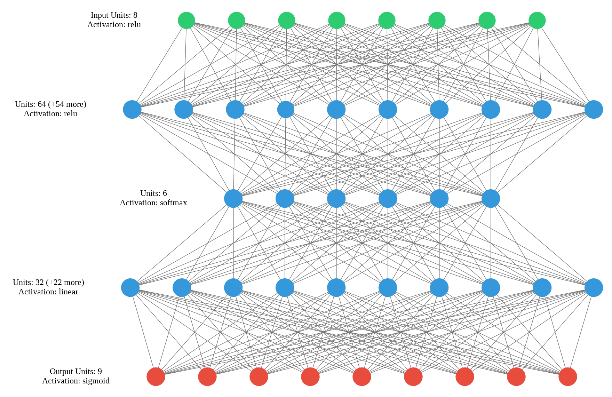
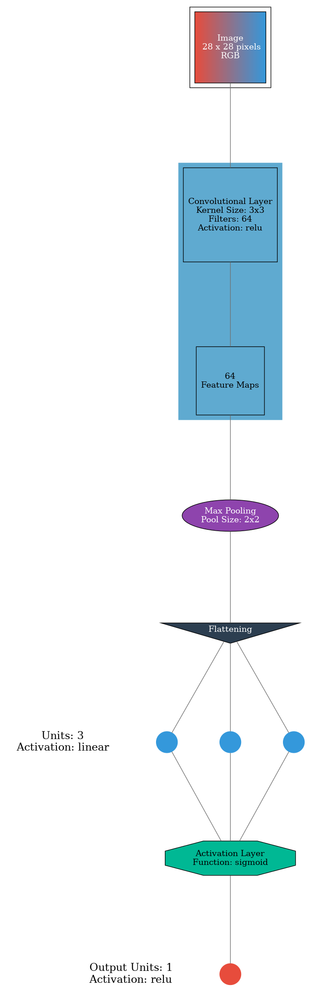
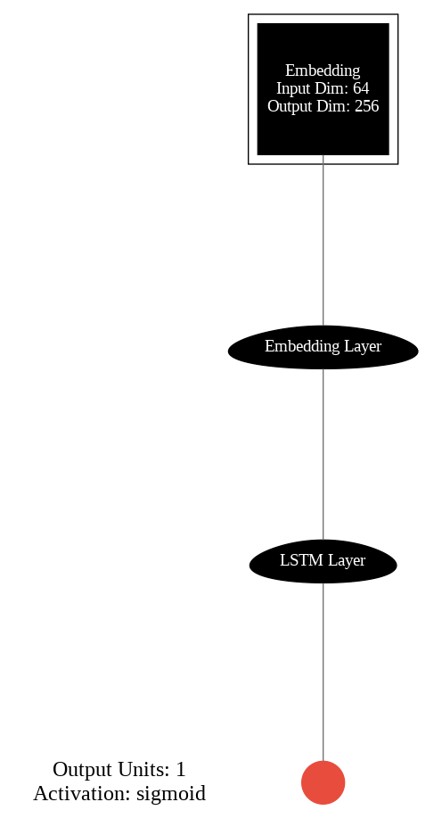

# Keras Visualizer


[](https://pypi.org/project/keras-visualizer)
[](https://pypistats.org/packages/keras-visualizer)
[](LICENSE)
[](https://vrgl.ir/5KSoN)
[](https://colab.research.google.com/github/mahyar-amiri/keras-visualizer/)

A Python Library for Visualizing Keras Models.

## Table of Contents

<!-- TOC -->

* [Keras Visualizer](#keras-visualizer)
    * [Table of Contents](#table-of-contents)
    * [Installation](#installation)
        * [Install](#install)
        * [Upgrade](#upgrade)
    * [Usage](#usage)
    * [Parameters](#parameters)
    * [Settings](#settings)
    * [Examples](#examples)
        * [Example 1](#example-1)
        * [Example 2](#example-2)
        * [Example 3](#example-3)
    * [Supported layers](#supported-layers)

<!-- TOC -->

## Installation

### Install

Use python package manager (pip) to install Keras Visualizer.

```bash
pip install keras-visualizer
```

### Upgrade

Use python package manager (pip) to upgrade Keras Visualizer.

```bash
pip install keras-visualizer --upgrade
```

## Usage

```python
from keras_visualizer import visualizer

# create your model here
# model = ...

visualizer(model, file_format='png')
```

## Parameters

```python
visualizer(model, file_name='graph', file_format=None, view=False, settings=None)
```

- `model` : a Keras model instance.
- `file_name` : where to save the visualization.
- `file_format` : file format to save 'pdf', 'png'.
- `view` : open file after process if True.
- `settings` : a dictionary of available settings.

> **Note :**
> - set `file_format='png'` or `file_format='pdf'` to save visualization file.
> - use `view=True` to open visualization file.
> - use [settings](#settings) to customize output image.

## Settings

you can customize settings for your output image. here is the default settings dictionary:

```python
settings = {
    # ALL LAYERS
    'MAX_NEURONS': 10,
    'ARROW_COLOR': '#707070',
    # INPUT LAYERS
    'INPUT_DENSE_COLOR': '#2ecc71',
    'INPUT_EMBEDDING_COLOR': 'black',
    'INPUT_EMBEDDING_FONT': 'white',
    'INPUT_GRAYSCALE_COLOR': 'black:white',
    'INPUT_GRAYSCALE_FONT': 'white',
    'INPUT_RGB_COLOR': '#e74c3c:#3498db',
    'INPUT_RGB_FONT': 'white',
    'INPUT_LAYER_COLOR': 'black',
    'INPUT_LAYER_FONT': 'white',
    # HIDDEN LAYERS
    'HIDDEN_DENSE_COLOR': '#3498db',
    'HIDDEN_CONV_COLOR': '#5faad0',
    'HIDDEN_CONV_FONT': 'black',
    'HIDDEN_POOLING_COLOR': '#8e44ad',
    'HIDDEN_POOLING_FONT': 'white',
    'HIDDEN_FLATTEN_COLOR': '#2c3e50',
    'HIDDEN_FLATTEN_FONT': 'white',
    'HIDDEN_DROPOUT_COLOR': '#f39c12',
    'HIDDEN_DROPOUT_FONT': 'black',
    'HIDDEN_ACTIVATION_COLOR': '#00b894',
    'HIDDEN_ACTIVATION_FONT': 'black',
    'HIDDEN_LAYER_COLOR': 'black',
    'HIDDEN_LAYER_FONT': 'white',
    # OUTPUT LAYER
    'OUTPUT_DENSE_COLOR': '#e74c3c',
    'OUTPUT_LAYER_COLOR': 'black',
    'OUTPUT_LAYER_FONT': 'white',
}
```

**Note**:

* set `'MAX_NEURONS': None` to disable max neurons constraint.
* see list of color names [here](https://graphviz.org/doc/info/colors.html).

```python
from keras_visualizer import visualizer

my_settings = {
    'MAX_NEURONS': None,
    'INPUT_DENSE_COLOR': 'teal',
    'HIDDEN_DENSE_COLOR': 'gray',
    'OUTPUT_DENSE_COLOR': 'crimson'
}

# model = ...

visualizer(model, file_format='png', settings=my_settings)
```

## Examples

you can use simple examples as `.py` or `.ipynb` format in [examples directory](examples).

### Example 1

```python
from keras import models, layers
from keras_visualizer import visualizer

model = models.Sequential([
    layers.Dense(64, activation='relu', input_shape=(8,)),
    layers.Dense(6, activation='softmax'),
    layers.Dense(32),
    layers.Dense(9, activation='sigmoid')
])

visualizer(model, file_format='png', view=True)
```



---

### Example 2

```python
from keras import models, layers
from keras_visualizer import visualizer

model = models.Sequential()
model.add(layers.Conv2D(64, (3, 3), input_shape=(28, 28, 3), activation='relu'))
model.add(layers.MaxPooling2D((2, 2)))
model.add(layers.Flatten())
model.add(layers.Dense(3))
model.add(layers.Dropout(0.5))
model.add(layers.Activation('sigmoid'))
model.add(layers.Dense(1))

visualizer(model, file_format='png', view=True)
```



---

### Example 3

```python
from keras import models, layers
from keras_visualizer import visualizer

model = models.Sequential()
model.add(layers.Embedding(64, output_dim=256))
model.add(layers.LSTM(128))
model.add(layers.Dense(1, activation='sigmoid'))

visualizer(model, file_format='png', view=True)
```



## Supported layers

[Explore list of **keras layers**](https://keras.io/api/layers/)

1. Core layers
    - [x] Input object
    - [x] Dense layer
    - [x] Activation layer
    - [ ] Embedding layer
    - [ ] Masking layer
    - [ ] Lambda layer

2. Convolution layers
    - [x] Conv1D layer
    - [x] Conv2D layer
    - [x] Conv3D layer
    - [x] SeparableConv1D layer
    - [x] SeparableConv2D layer
    - [x] DepthwiseConv2D layer
    - [x] Conv1DTranspose layer
    - [x] Conv2DTranspose layer
    - [x] Conv3DTranspose layer

3. Pooling layers
    - [x] MaxPooling1D layer
    - [x] MaxPooling2D layer
    - [x] MaxPooling3D layer
    - [x] AveragePooling1D layer
    - [x] AveragePooling2D layer
    - [x] AveragePooling3D layer
    - [x] GlobalMaxPooling1D layer
    - [x] GlobalMaxPooling2D layer
    - [x] GlobalMaxPooling3D layer
    - [x] GlobalAveragePooling1D layer
    - [x] GlobalAveragePooling2D layer
    - [x] GlobalAveragePooling3D layer

4. Reshaping layers
    - [ ] Reshape layer
    - [x] Flatten layer
    - [ ] RepeatVector layer
    - [ ] Permute layer
    - [ ] Cropping1D layer
    - [ ] Cropping2D layer
    - [ ] Cropping3D layer
    - [ ] UpSampling1D layer
    - [ ] UpSampling2D layer
    - [ ] UpSampling3D layer
    - [ ] ZeroPadding1D layer
    - [ ] ZeroPadding2D layer
    - [ ] ZeroPadding3D layer

5. Regularization layers
    - [x] Dropout layer
    - [x] SpatialDropout1D layer
    - [x] SpatialDropout2D layer
    - [x] SpatialDropout3D layer
    - [x] GaussianDropout layer
    - [ ] GaussianNoise layer
    - [ ] ActivityRegularization layer
    - [x] AlphaDropout layer